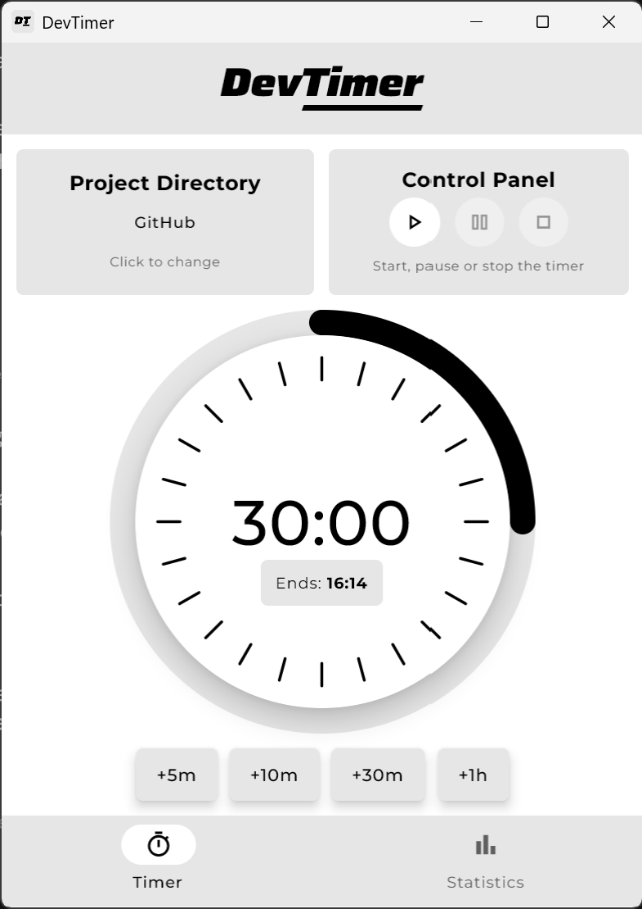
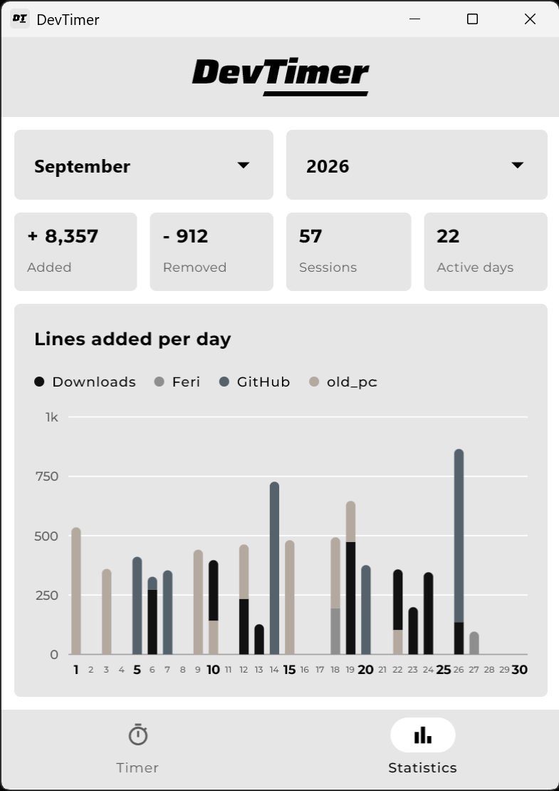

<p align="center">
  
</p>

<h3 align="center">
  A developer focus timer that tracks lines of code being added and removed during a session.
</h3>

<p align="center">
  
  
  
</p>

<br>

<div align="center">
  
  
</div>

---

## 📖 About
DevTimer started as a university assignment. After the course has ended, I kept building on it:
- 🔄 Redesigned the UI and added some new features.
- 📦 This repository is a fresh copy, since the original course repository will be removed.

## ✨ Features
- 🎯 Set a timer with a wheel, scroll wheel, or quick-add buttons
- 📝 Counts lines of code added and removed in a project folder
- 📊 Monthly statistics with a stacked bar chart per project
   - Projects stack in order you worked on them that day
- 🗄️ Local SQLite storage
- 🔊 Completion sound

<!-- CHANGED: "Tech stack" -> "Tech Stack" to match the capitalization of "Install & Run" -->
## 💻 Tech Stack

- 🟣 Kotlin + Compose Multiplatform
- 🗄️ SQLDelight + SQLite

## 🚀 Install & Run

1. Clone the project
   ```bash
   git clone https://github.com/Maercel/dev-timer.git
   ```
2. Open the folder in IntelliJ IDEA and wait for Gradle to sync
3. Run the app
   ```bash
   ./gradlew :composeApp:run
   ```
   or press <kbd>Shift</kbd> + <kbd>F10</kbd>

📦 Build a Windows installer with `./gradlew :composeApp:packageMsi` (JDK 17+).

## 🌐 Supported Languages

<details>
<summary><b>Suported languages and ignored folders</b></summary>

Kotlin, Java, Scala, Groovy, JavaScript, TypeScript, Vue, Svelte, C, C++, C#, Objective-C, Go, Rust, Swift, Dart, PHP, Python, Ruby, Shell, PowerShell, R, Lua, SQL, HTML, CSS, SCSS

Folders like `build`, `node_modules`, `.git`, `.gradle`, `target`, `dist` and `venv` are ignored.

</details>

---

## 🤝 Credits

🔊 Sound: "Ending Elevator" by kittencatpuppydog88 on Pixabay.
